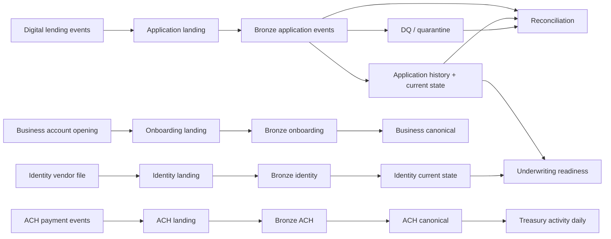

# Data flow

```mermaid
flowchart LR
    A[Digital lending events] --> B[Application landing]
    C[Identity vendor file] --> D[Identity landing]
    E[Business account opening] --> F[Onboarding landing]
    G[ACH payment events] --> H[ACH landing]

    B --> I[Bronze application events]
    D --> J[Bronze identity]
    F --> K[Bronze onboarding]
    H --> L[Bronze ACH]

    I --> M[DQ / quarantine]
    I --> N[Application history + current state]
    J --> O[Identity current state]
    K --> P[Business canonical]
    L --> Q[ACH canonical]

    N --> R[Underwriting readiness]
    O --> R
    Q --> S[Treasury activity daily]

    I --> T[Reconciliation]
    N --> T
    M --> T
```
